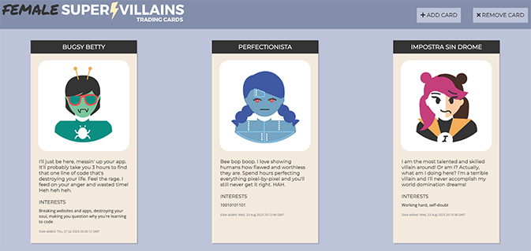

# Female Supervillain Trading Card App (template version)
An interactive web application that stores and displays female supervillain trading cards. The app is built with Python and Flask and uses an SQL database. 

## About
In the Female Supervillain Trading Card app, users can:

- add female supervillain trading cards to a database.
- delete female supervillain trading cards from a database.

## Project Background
The Female Supervillain Trading Card app was built as part of Skillcrush's "Using Python to Build Web Apps" course. 

The user inputs data for a new supervillain card in an HTML form on the front end and the data is stored in an SQL database. The app is created with the Flask web framework, using SQLAlchemy and the Flask-SQLAlchemy extension to interact with the SQL database. The app uses routing and HTTP methods to render data between the back end and front end, and Jinja to place data in HTML templates. 

During this project, I practiced: 

- Working with Flask boilerplate and setting up Flask in the main.py file. 

- Setting up an SQL database using SQLAlchemy and Flask-SQLAlchemy, incl. configuring the root location of the database and connecting the SQLAlchemy toolkit to the Flask app. 

- Creating a database model and building database columns to store and organize data. 

- Writing code to create an SQL database with the design specified in the database model.

- Interacting with an SQL database, incl. querying the database and using request object methods to retrieve inputted data from an HTML form. 

- Adding routing and using HTTP methods to add and delete data from the database, render HTML with data submitted by users on an HTML form, and handle error messages for the user. 

- Using Jinja templating to place data in HTML templates.

## Built With 
- Python
- Flask
- SQL database
- SQLAlchemy 
- Flask-SQLAlchemy
- Jinja 
- CSS3
- HTML5

## Launch
[See the live version of the Female Supervillain Trading Card app (template version) here.](https://skillcrush-py-cl02-ls08-villain-cards-flask-template-final.lonemortensen.repl.co/)

## Acknowledgements

**Skillcrush** - With support and guidance from Skillcrush, I coded the Female Supervillain Trading Card app's Python file and used Jinja to place data in the app's HTML file. The app's HTML and CSS files and their contents were provided by Skillcrush.  